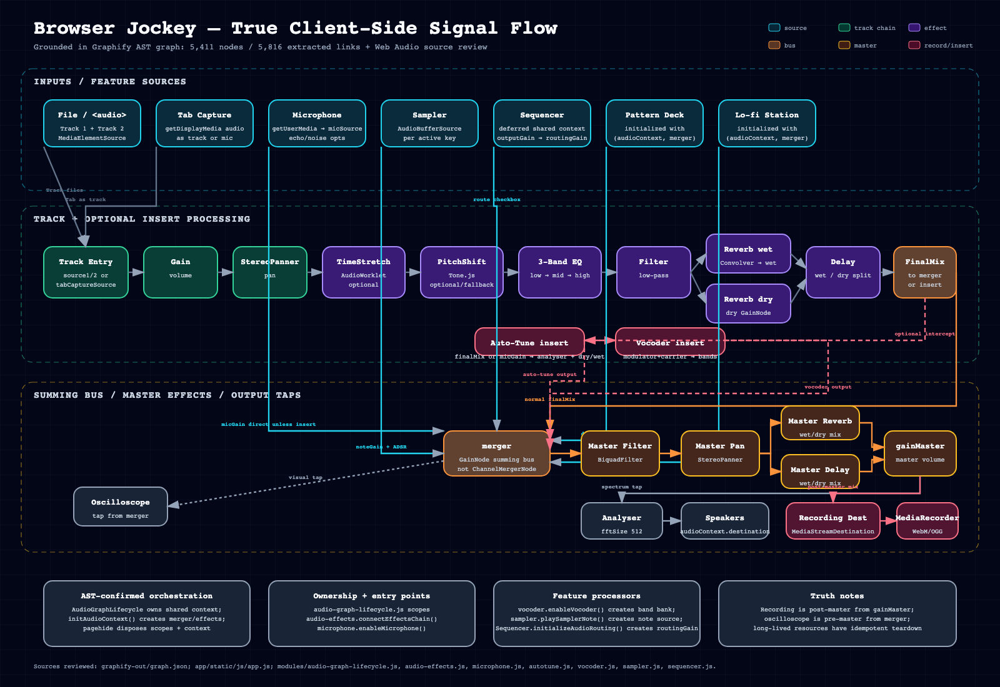

# Browser Jockey — Audio Graph Reference

**Version:** v3.33+
**Last updated:** 2026-07-09

All signal processing is client-side via the Web Audio API. There is one shared `AudioContext` for the entire application. Tone.js nodes are created inside that same context via `Tone.setContext(audioContext)`.

---

## Top-Level Signal Flow



The diagram above was regenerated from a review of the Graphify AST output in `graphify-out/graph.json` (5,411 AST-origin nodes and 5,816 extracted links) plus the concrete Web Audio connection code in `app/static/js/app.js` and the audio modules. The key correction is that `merger` is a `GainNode` summing bus, not a `ChannelMergerNode`; recording and visualization are taps from specific points in the graph.

```
Track 1 ──────────────────────────────────────────────────────────┐
Track 2 ──────────────────────────────────────────────────────────┤
Microphone ────────────────────────────────────────────────────────┤──► merger (GainNode) ──► [Master Chain] ──► outputs
Tab Capture ───────────────────────────────────────────────────────┤
Sampler ───────────────────────────────────────────────────────────┤
Sequencer (optional) ──────────────────────────────────────────────┘
```

---

## Audio graph ownership and lifecycle

`modules/audio-graph-lifecycle.js` is the owner of the shared application `AudioContext` and named resource scopes.

- `application` owns subsystem teardown for playback controllers, sequencer, sidechain, Pattern Deck, Lo-fi Station, transcription worker, theremin, recording loops, and capture streams.
- `microphone` is a replaceable scope. Re-enabling the microphone or switching to tab capture disposes the previous stream, source, gain, analyser, and waveform loop before adopting the replacement.
- `pagehide` disposes all scopes and closes the shared context unless the page is entering the browser back/forward cache.
- The Sequencer initializes its UI without an AudioContext. Its gain graph is created later against the shared context, eliminating the previous leaked temporary context.
- Short-lived contexts used only for file decoding are lexical resources and close in `finally` blocks, including decode failures.

New audio features must either register long-lived resources in a named scope or expose an idempotent `destroy()` method adopted by the `application` scope. Direct creation of an additional long-lived `AudioContext` is not allowed.

---

## 1. Master Chain

Created in `initAudioContext()` (`app.js:3113`).

`merger` is a plain **GainNode** (not `ChannelMergerNode`), acting as a summing bus.

```
merger (GainNode, gain=1.0)
  │
  ▼
filterMaster (BiquadFilterNode)
  │
  ▼
pannerMaster (custom Panner: GainNode.input → StereoPannerNode → GainNode.output)
  │
  ├──► reverbMaster.convolver (ConvolverNode) ──► reverbMaster.wet (GainNode) ──┐
  │                                                                              ├──► reverbMixMaster (GainNode)
  └──► reverbMaster.dry (GainNode) ────────────────────────────────────────────┘
         │
         ▼
       reverbMixMaster
         │
         ├──► delayMaster.node (DelayNode) ──► delayMaster.wet (GainNode) ──┐
         │                                                                   ├──► finalMixMaster (GainNode)
         └──► delayMaster.dry (GainNode) ─────────────────────────────────┘
                │
                ▼
             finalMixMaster (GainNode)
                │
                ▼
             gainMaster (GainNode)  ◄── master volume slider
                │
                ├──► analyser (AnalyserNode, fftSize=512) ──► audioContext.destination  [SPEAKERS]
                ├──► recordingDestination (MediaStreamDestination) ──► MediaRecorder      [RECORDING]
                └──► recordingAnalyser (AnalyserNode, fftSize=2048)                       [RECORDING VIZ]

merger ──► oscilloscopeAnalyser (AnalyserNode)                                            [OSCILLOSCOPE VIZ]
```

**Key:** `merger` is also tapped by `oscilloscopeAnalyser` for the oscilloscope display. Recording captures from `gainMaster` (post-master-effects), so it includes reverb/delay/EQ applied at the master bus.

---

## 2. Track 1 / Track 2 Signal Chain

Created in `audio-effects.js → initAudioEffects()`, connected by `connectEffectsChain()`.

```
source1 (MediaElementSource — from <audio> element or mic recording blob)
  │
  ▼
gain1 (GainNode)  ◄── track volume slider
  │
  ▼
panner1 (custom Panner: GainNode.input → StereoPannerNode → GainNode.output)  ◄── pan slider
  │
  ▼
[timestretchNode1]  (AudioWorkletNode — phase vocoder; optional, only when timestretch ≠ 1.0x)
  │
  ▼
pitchShifter1 (Tone.PitchShift, pitch=0 semitones default)  ◄── per-track pitch slider
  │  [if Tone.js unavailable: this node is skipped and panner connects directly to EQ]
  ▼
eqLow1 (BiquadFilterNode, lowshelf)   ◄── EQ low slider
  │
  ▼
eqMid1 (BiquadFilterNode, peaking)    ◄── EQ mid slider
  │
  ▼
eqHigh1 (BiquadFilterNode, highshelf) ◄── EQ high slider
  │
  ▼
filter1 (BiquadFilterNode, lowpass)   ◄── filter cutoff slider
  │
  ├──► reverb1.convolver (ConvolverNode) ──► reverb1.wet (GainNode) ──┐
  │                                                                    ├──► reverbMix1 (GainNode)
  └──► reverb1.dry (GainNode) ───────────────────────────────────────┘
         │
         ▼
       reverbMix1
         │
         ├──► delay1.node (DelayNode) ──► delay1.wet (GainNode) ──┐
         │                                                          ├──► finalMix1 (GainNode)
         └──► delay1.dry (GainNode) ──────────────────────────────┘
                │
                ▼
             finalMix1 (GainNode)
                │
                ▼
             merger  [under normal conditions]
```

Track 2 is identical, with `source2`, `gain2`, `panner2`, ..., `finalMix2`.

**Note:** `finalMix1`/`finalMix2` are the last nodes before `merger`. Auto-tune intercepts here (see §5).

---

## 3. Microphone Chain

Created in `microphone.js → enableMicrophone()`.

```
getUserMedia stream
  │
  ▼
micSource (MediaStreamSource)
  │
  ▼
micGain (GainNode)  ◄── mic volume slider
  │
  ├──► micAnalyser (AnalyserNode, fftSize=2048)   [mic waveform visualization]
  │
  └──► merger  [when mic is active and not in autotune/vocoder mode]
```

---

## 4. Tab Capture Chain

Initiated by `captureTabAudio()` (`app.js:1717`). The captured stream is routed through the same effect chain as a regular track.

```
getDisplayMedia stream (audio track)
  │
  ▼
tabCaptureSource1/2 (MediaStreamSource)  →  used as source1/source2
  │
  ▼
[same chain as Track 1/2 from gain1/gain2 onward]
```

---

## 5. Auto-Tune Insertion

Auto-tune intercepts **after** the full per-track effects chain (`finalMix1`/`finalMix2`), or after `micGain` for the mic source.

**Before auto-tune:**
```
finalMix1 ──► merger
```

**After auto-tune is enabled on Track 1:**
```
finalMix1.disconnect(merger)

finalMix1
  │
  ├──► autotuneAnalyser (AnalyserNode, fftSize=4096)   [pitch detection — read by correctPitch()]
  │
  ├──► dryGain (GainNode, gain = 1 - strength)
  │      │
  │      └──► merger
  │
  └──► pitchShifter.input.input (native GainNode inside Tone.PitchShift)
         │
         ▼
       [Tone.PitchShift — phase vocoder AudioWorklet]
         │
         ▼
       wetGain (GainNode, gain = strength)
         │
         └──► merger
```

**Pitch correction loop** (`correctPitch()` in `app.js`, runs every 20ms):
```
autotuneAnalyser
  │ getByteFrequencyData()
  ▼
detectPitch()  ──► detected frequency (Hz)
  │
  ▼
findNearestNoteInScale(freq, key, scaleType)  ──► target frequency (Hz)
  │
  ▼
correctPitchToTarget()  ──► pitchShifter.pitch = semitones (clamped ±12)
```

**On disable:** `disableAutotune()` disconnects `dryGain`, `wetGain`, `pitchShifter`, disposes the Tone.js node, and reconnects `finalMix1 → merger` directly.

---

## 6. Vocoder Insertion

Modulator and carrier are independently routed into the vocoder band bank. The vocoder output connects to `merger`.

```
MODULATOR (mic / track1 / track2):
  micGain / gain1 / gain2
    │
    ├──► [per band, 10 bands]:
    │       modulatorFilter (BiquadFilterNode, bandpass, fc = band center)
    │         │
    │         ▼
    │       envelopeFollower (WaveShaper — full-wave rectifier)
    │         │
    │         ▼
    │       smoothingFilter (BiquadFilterNode, lowpass, fc ≈ 15 Hz)  [BUG-003 fix]
    │         │
    │         └──► bandGain.gain (AudioParam on carrier GainNode)  [drives carrier amplitude]

CARRIER (mic / track1 / track2 / oscillator):
    carrierSource
      │
      ├──► [per band, same 10 bands]:
      │       carrierFilter (BiquadFilterNode, bandpass, fc = band center)
      │         │
      │         ▼
      │       bandGain (GainNode, gain modulated by modulator envelope above)
      │         │
      │         └──► vocoderOutput (GainNode summing all bands)
      │
      └──► vocoderOutput
               │
               └──► merger
```

When carrier = `'mix'`, a `mixGainNode` is created to sum multiple carrier sources before the band bank. This node is stored in `vocoderState.mixGainNode` for cleanup on disable.

---

## 7. Sampler Chain

Sampler plays `AudioBufferSourceNode` instances directly into `merger`. No per-note effects chain.

```
AudioBufferSourceNode (one per active key)
  │
  ▼
samplerGainNode (GainNode — ADSR envelope)
  │
  ▼
merger
```

---

## 8. Sequencer Chain

```
sequencerGain (GainNode — exposed by Sequencer module)
  │
  └──► merger  [only when "Route Sequencer to Master" checkbox is checked]
```

---

## 9. Visualization Taps (read-only, no downstream audio)

| Analyser | Tapped From | Purpose |
|----------|-------------|---------|
| `analyser` (fftSize=512) | `gainMaster` output | Frequency spectrum display |
| `recordingAnalyser` (fftSize=2048) | `gainMaster` output | Recording level meter |
| `oscilloscopeAnalyser` | `merger` | Oscilloscope waveform |
| `micAnalyser` (fftSize=2048) | `micGain` | Mic waveform |
| `autotuneAnalyser` (fftSize=4096) | `finalMix1/2` or `micGain` | Pitch detection |

---

## 10. Recording Output

### Master recording (main record button)
```
gainMaster (GainNode)
  │
  └──► recordingDestination (MediaStreamDestination)
         │
         └──► MediaRecorder  →  records to WebM/OGG blob
```
Captures the **full processed mix** — all tracks, mic, master effects included.

### Mic recording (mic record button)

**Without auto-tune active:**
```
micState.micStream  (raw getUserMedia stream — pre-Web Audio)
  │
  └──► MediaRecorder  →  records to WebM blob
```
Captures the **unprocessed microphone signal**. Web Audio effects are NOT captured.

**With auto-tune active on mic source (fixed 2026-03-07):**
```
autotuneState.dryGain ──┐
                         ├──► autotuneRecordDest (MediaStreamDestination)
autotuneState.wetGain ──┘         │
                                   └──► MediaRecorder  →  records auto-tuned audio
```
A dedicated `MediaStreamDestination` is tapped from the autotune dry+wet gain nodes, capturing exactly the pitch-corrected mic signal without any other tracks. `autotuneRecordDest` is disconnected when recording stops.

---

## 11. Known Audio Graph Issues (from QA_BUG_REPORT.md)

| # | Location | Issue |
|---|----------|-------|
| BUG-008 | `AudioBufferManager` | `loopBuffers` and `timestretched` Maps grow unbounded (no LRU eviction) |
| BUG-009 | `vocoder.js` | `mixGainNode` (carrier='mix') was not stored → memory leak on repeated enable/disable (fixed) |
| BUG-010 | `loop-controls.js` | RAF callback ID not stored; cannot force-cancel on mode switch |
| BUG-011 | `microphone.js` | Waveform RAF captures `enabled` primitive, not reference; loop can survive `enabled=false` |

---

## 12. Autotune Diagnostic Notes

**Why auto-tune may produce no audible effect:**

1. **Pitch detection silent** — `autoCorrelate()` (old) used a 0.9 MAD threshold that almost never triggers on music signals. Fixed (2026-03-07): `correctPitch()` now uses `getByteFrequencyData` + `detectPitch()` (frequency-domain peak), which is more reliable across signal types.

2. **Scale snap broken below root** — `getNearestNoteFrequency()` (old) called `Math.round(semitones) % 12` where semitones can be negative. JS `%` preserves sign, so noteInOctave could be e.g. -7 (never matching any interval 0–11). A note at E3 with key=G would snap to G2 instead of E3. Fixed: `correctPitch()` now uses `findNearestNoteInScale()` from the module, which uses `((Math.round(midiNote) % 12) + 12) % 12` (always 0–11).

3. **Wrong interception point** — original `enableAutotune()` used `gain1` as source. `gain1.disconnect(merger)` silently failed because `gain1` connects to `panner1`, not directly to `merger`. The original `finalMix1 → merger` path stayed active at full volume, drowning the autotune signal. Fixed (2026-03-07): source is now `finalMix1`/`finalMix2`, which does directly connect to `merger`.

4. **Tone.js PitchShift context** — if `initAudioEffects()` hasn't run yet when `enableAutotune()` is called (e.g., autotune enabled on mic before any track is loaded), `Tone.setContext(audioContext)` in `autotune.js` must succeed. Confirm with console: look for `"Auto-tune enabled with Tone.PitchShift"` (not the bypass message).
