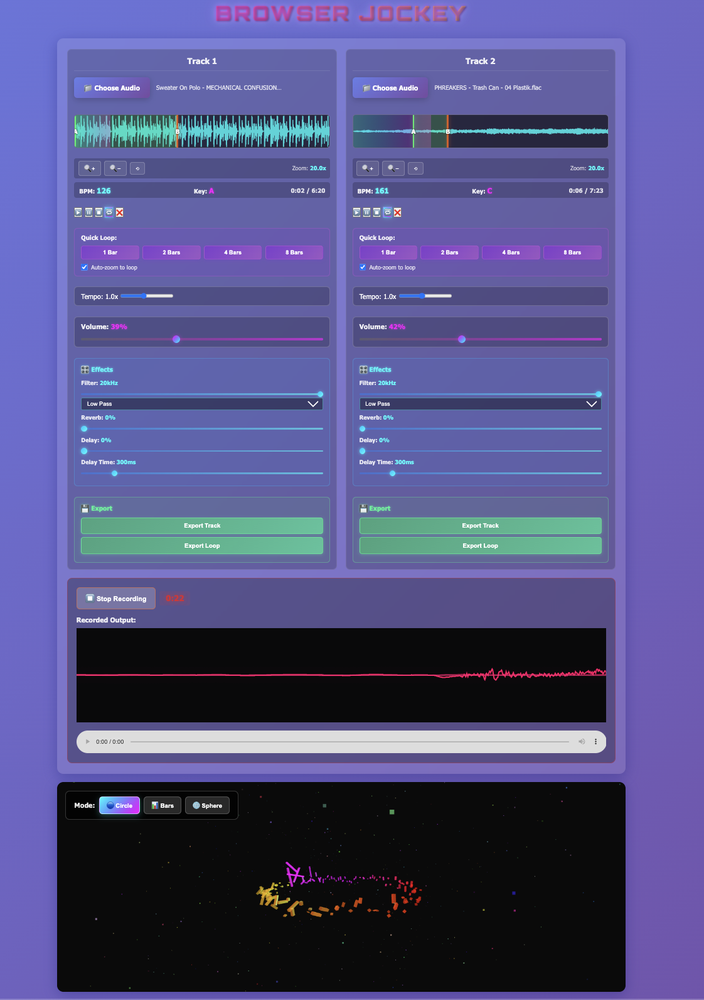
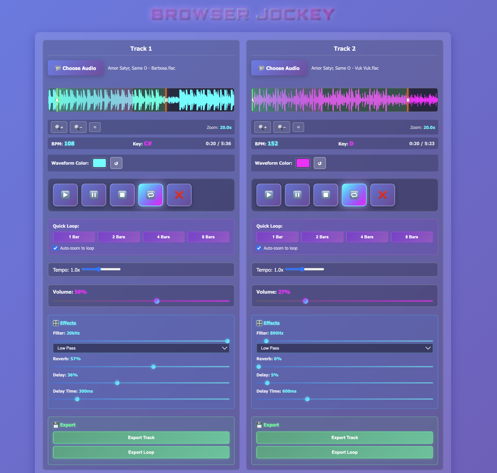
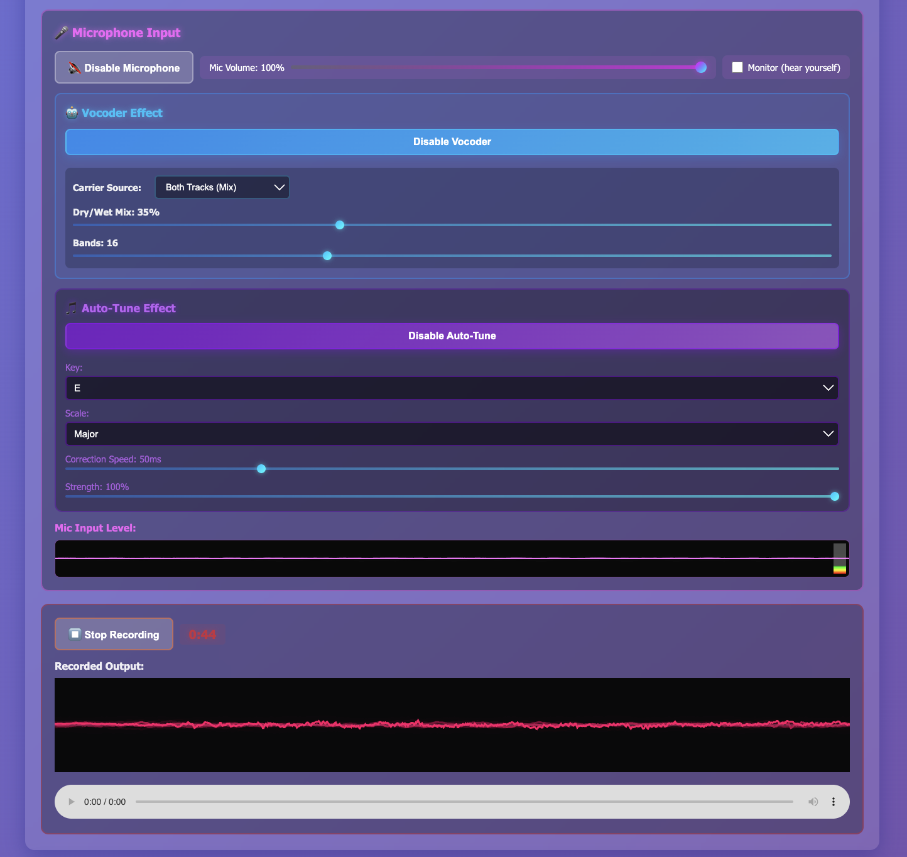
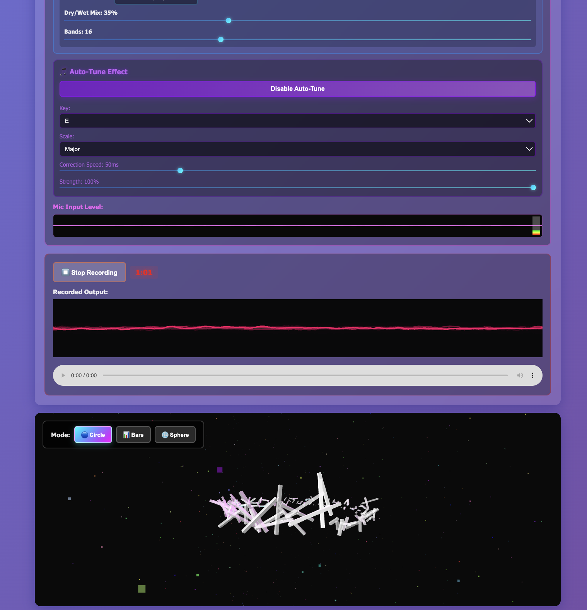
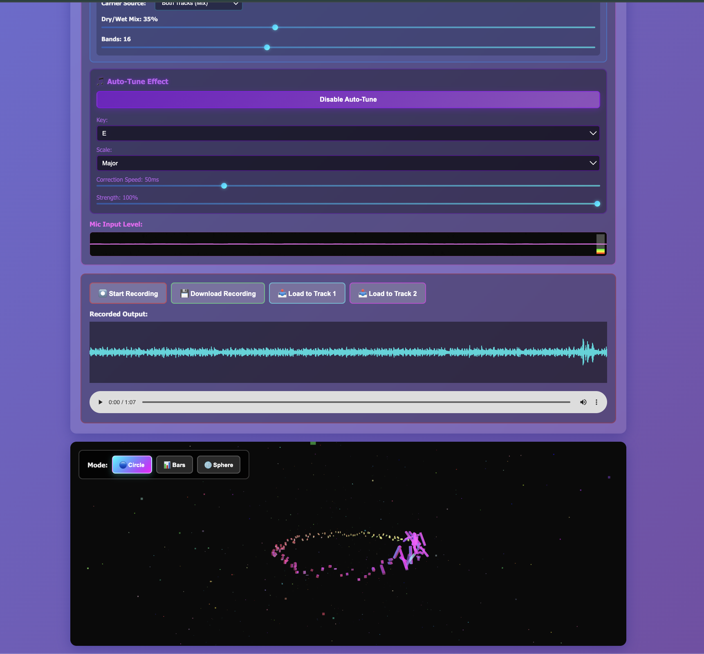
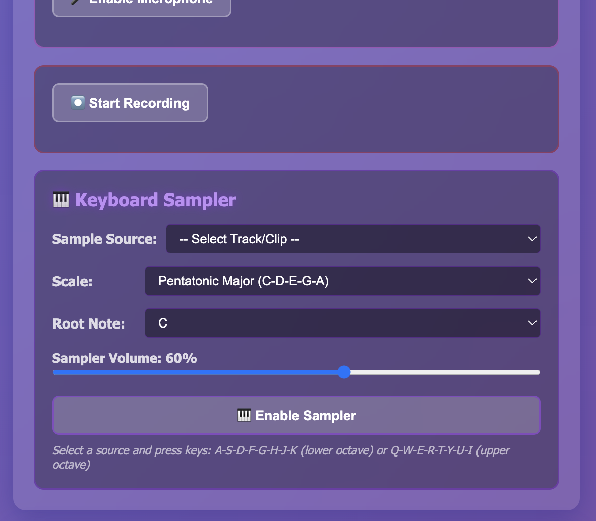

# Browser Jockey

[](https://browser-jockey.onrender.com/)

A dual-track DJ mixing web application with 3D audio visualization, BPM detection, precise loop markers, audio effects, microphone input with vocoder and auto-tune, standalone microphone recording, flexible audio routing, professional crossfader, browser tab audio capture, sequencer recording with track integration, and authentic DJ controls.

**Latest Update (v3.19.1)**: Bugfix - Fixed master recording to track playback. Audio element source is now preserved when loading recordings to tracks, fixing silent playback issue. All recording workflows (master, sequencer, microphone, tab capture) now work correctly when loading to Track 1 or Track 2. See [RELEASE_NOTES_v3.19.1.md](RELEASE_NOTES_v3.19.1.md).

**v3.19.0**: Added Sequencer Recording with Track Integration! Record your sequencer arrangements with one click, preview with waveform, and load directly to DJ tracks. Includes high-quality Opus encoding, auto-stop at timeline end, loop recording mode, and seamless integration with DJ mixer. Also includes double-click loop marker adjustment, clip name overflow fixes, and critical audio capture timing fixes. See [RELEASE_NOTES_v3.19.md](RELEASE_NOTES_v3.19.md) for full details.

**v3.14.0**: Added Precise Loop Markers with millisecond accuracy! Set loop points with numeric inputs (0.001s precision), interactive time tooltip on hover, intelligent marker adjustment, and fixed zoom click detection. Perfect for chopping tiny segments from tab-captured audio or any track. Works seamlessly at 16x-20x zoom levels. See [PRECISE_LOOP_MARKERS.md](PRECISE_LOOP_MARKERS.md) for details.

**v3.13.0**: Added browser tab audio capture! Capture audio from any browser tab (YouTube, Spotify, etc.) and route it through Track 1, Track 2, or Microphone input with full effects support. Record tab capture to master output, mix with other tracks, apply vocoder/auto-tune, and use the crossfader. Perfect for DJing with streaming services or remixing online content! See [TAB_CAPTURE_FEATURE.md](TAB_CAPTURE_FEATURE.md) for details.

**v3.11.0**: Added Camera Theremin! Motion-controlled instrument using webcam with wave detection, adjustable sensitivity, three control modes (Pitch & Volume, Filter & Resonance, ADSR Envelope), audio sources (oscillator, Track 1, Track 2), adaptive motion detection, wave-only mode, visual feedback, and master volume/vibrato controls. See [CAMERA_THEREMIN_FEATURE.md](CAMERA_THEREMIN_FEATURE.md).

**v3.10.0**: Added professional DJ crossfader with three modes (Track1↔Track2, Track1↔Mic, Track2↔Mic)! Features equal-power crossfade curves for smooth transitions, dynamic mode switching, and full three-column DJ layout (Track 1 | Mixer | Track 2). Master section reorganized with compact volume/pan controls.

**v3.9.0**: Major microphone and effects routing enhancements! Added standalone microphone recording (record directly from mic without tracks), flexible vocoder/auto-tune routing (use mic OR tracks as sources), load microphone recordings to tracks, side-by-side tempo/volume controls for compact layout, and master output routing toggles for precise mixing control.

## Screenshots












*v3.0 Keyboard Sampler Feature - Play tracks/loops on pentatonic scales using keyboard*

## Features

- 🎧 **Professional DJ Layout** - Authentic three-column DJ mixer design
  - 🎛️ Dual decks side-by-side (cyan/magenta color coding)
  - 🎚️ Vertical faders for volume and tempo (like real DJ mixers)
  - 🔄 Horizontal pan controls for stereo positioning
  - 🎚️ Center mixer section with crossfader and dual track controls
  - 🏆 Master output with integrated recording section
  - ✨ Glowing effects and neon accents matching DJ equipment
- 🌐 **Browser Tab Audio Capture** - Capture audio from any browser tab
  - 📺 Capture YouTube, Spotify, SoundCloud, or any tab playing audio
  - 🎚️ Route to Track 1, Track 2, or Microphone input
  - 🎛️ Full effects support (volume, pan, filter, reverb, delay)
  - ⏺️ Record tab capture to master output
  - 🤖 Use with vocoder/autotune effects
  - 🔀 Mix with crossfader and other tracks
  - 💾 Record and load back to tracks for remixing
  - ⚠️ Chrome/Edge only (browser limitation)
- 🎼 **Sequencer with Recording** - Arrange and record multi-track compositions
  - 📦 Load clips from DJ tracks or upload new files
  - 🎚️ 4 independent sequencer tracks with volume, solo, mute
  - 📊 Visual timeline with bar-based positioning
  - 🎨 Per-clip effects (volume, ADSR envelope, reverb, delay)
  - 🔁 Loop playback with adjustable loop markers
  - 🖱️ **Double-click loop adjustment** - Click ruler to move nearest marker
  - ⏺️ **One-Click Recording** - Record sequencer output with single button
  - 🎙️ High-quality Opus encoding (128kbps WebM)
  - ⏱️ Real-time recording timer and waveform preview
  - 🔄 Auto-stop at timeline end or continuous loop recording
  - 📥 **Load to Tracks** - Send recordings directly to Track 1 or Track 2
  - 🔀 **Seamless Integration** - Recorded tracks work like any other audio
  - 💾 Export recordings or process further in DJ mixer
  - 🎛️ Full track controls enabled (play, loop, effects, export)
- ⚡ **Professional Crossfader** - Smooth transitions with equal-power curves
  - 🔀 Three modes: Track1↔Track2, Track1↔Mic, Track2↔Mic
  - 📊 Equal-power crossfade algorithm (constant perceived loudness)
  - 🎨 Visual gradient slider with dynamic labels
  - 🎚️ Respects individual volume slider settings
- 🎚️ **Stereo Panning** - Full L/R stereo control for each track and master output
- 🎛️ **Dual Track DJ System** - Load and mix two audio tracks simultaneously
- ▶️▶️ **Dual Track Controls** - Play both tracks at once, or play both and record simultaneously
- 🎤 **Advanced Microphone System** - Professional microphone input with extensive features
  - 🎙️ Live mic input with volume control and real-time waveform monitoring
  - ⏺️ **Standalone Recording** - Record directly from microphone without any tracks loaded
  - 💾 Export mic recordings as WAV or MP3
  - 📥 **Load to Tracks** - Load mic recordings directly to Track 1 or Track 2
  - 🔀 **Flexible Routing** - Use microphone OR tracks as sources for effects
  - 🎛️ **Master Routing Control** - Toggle Track 1, Track 2, Microphone, or Keyboard Sampler to master output
- 🤖 **Vocoder Effect** - Robot voice effect with advanced routing
  - 8-32 frequency bands with adjustable mix
  - Select modulator source: Microphone, Track 1, or Track 2
  - Select carrier source: Microphone (Feedback), Track 1, Track 2, or Both Tracks (Mix)
  - Mic-to-mic feedback for creative robotic effects
  - **NEW**: Use tab capture audio with vocoder!
- 🎵 **Auto-Tune Effect** - Real-time pitch correction with flexible sources
  - Select audio source: Microphone, Track 1, or Track 2
  - Key/scale selection with adjustable correction speed and strength
  - Works standalone or with tracks
  - **NEW**: Use tab capture audio with auto-tune!
- 📊 **ADSR Envelope Effects** - Professional envelope shaping for dynamic control
  - 📈 Attack (1-2000ms), Decay (1-2000ms), Sustain (0-100%), Release (1-5000ms)
  - 🎚️ Available for Track 1, Track 2, Master output, and Keyboard Sampler
  - 🔘 Manual trigger buttons for precise envelope activation
  - 🔗 Integrated into drag-and-drop effect chains
  - 🎹 Conditional sampler ADSR (enable/disable per note)
  - 💡 15+ creative use cases documented (plucks, pads, stabs, gates, swells)
- 📹 **Camera Theremin** - Motion-controlled instrument using webcam
  - 👋 Wave detection with adjustable sensitivity (0.5x-3.0x)
  - 🎛️ Three control modes: Pitch & Volume, Filter & Resonance, ADSR Envelope
  - 🎵 Audio sources: Built-in oscillator, Track 1, or Track 2
  - 💡 Adaptive motion detection for varied lighting conditions
  - 🎨 Wave-only mode (no hand detection required) for easier activation
  - 🌊 Visual feedback: Cyan (searching) → Orange (wave to activate) → Green (active)
  - 🎚️ Master volume, vibrato controls, pitch range selection
  - 🔊 Routes to master output with individual routing toggle
- 🎵 **BPM Detection** - Automatic tempo detection for each track
- 🎹 **Key Detection** - Per-track musical key analysis
- 🔁 **Precise Loop Markers** - Millisecond-accurate loop point control
  - 🎯 **Numeric Inputs** - Set exact loop times with 0.001s precision
  - 🖱️ **Time Tooltip** - Hover to preview exact time before clicking
  - 🧠 **Smart Adjustment** - Click moves nearest marker automatically
  - 🔍 **Zoom Compatible** - Works perfectly at 16x-20x zoom levels
  - ⌨️ **Arrow Key Fine-Tuning** - Adjust by ±0.001s increments
  - 💡 **In-App Hints** - Clear guidance without reading docs
  - 🎛️ **Fixed Click Detection** - No more ignored clicks when zoomed
  - ✨ **Quick Loop Integration** - Refine auto-generated loops manually
  - 📦 **Perfect for Tab Capture** - Chop tiny segments with precision
- 🔁 **A-B Loop Markers** - Create precise loops with draggable markers
- ⏪ **Reverse Loop** - Play loops backwards with seamless toggle (perfect for live performance)
- ⚡ **Quick Loops** - Auto-create 1, 2, 4, or 8 bar loops based on BPM
- 🎚️ **Seamless Loop Control** - Toggle between forward/reverse during playback with no audio cuts
- 🔍 **Waveform Zoom** - Zoom up to 20x with drag-to-pan
- 🔗 **Drag-and-Drop Effect Chains** - Visually reorder effects for Track 1, Track 2, and Master output
  - 🎚️ Filter, Reverb, Delay, ADSR per track
  - ✓/✗ Toggle effects on/off with dynamic slider visibility
  - ⋮⋮ Drag to reorder effect processing
  - 🏆 Master effect chain with golden theme for final mix processing
- 🎚️ **Audio Effects** - Reverb, delay, and filters (low/high/band pass)
- 🎛️ **Master Output Effects** - Apply professional mastering effects to the final mixed output
- ⏺️ **Master Recording** - Record your mix directly from master output
  - 💾 Export as WebM, WAV, or MP3
  - 📥 Load recordings back to tracks for layering
  - **NEW**: Records tab capture audio with all effects!
- 💾 **Export** - Export full stems or loop regions as WAV or MP3 files
- 🎵 **Format Options** - Choose between WAV (lossless) or MP3 (compressed 128kbps) export
- 📊 **3D Visualization** - Real-time WebGL visualization with Three.js (Circle/Bars/Sphere modes)
- 〰️ **XY Oscilloscope** - Lissajous mode visualization with Cartesian coordinates
  - 📐 Centered at (0,0) with clear X/Y axes
  - 🎨 Dynamic phase-offset plotting for complex patterns
  - 🌈 Radial gradient colors (magenta→cyan)
  - ✨ Motion blur trails and glow effects
  - 🎯 Shows stereo correlation and harmonic relationships
  - 🎵 Displays live mix OR recorded audio playback
  - 🔄 Auto-switches between tracks and recordings
- 🌈 **Dynamic Heat Map Colors** - Circle mode bars change color based on energy (blue→cyan→green→yellow→red)
- 🎨 **Musical Key Colors** - Visualization colors based on detected key
- 🎹 **Keyboard Sampler** - Play tracks/loops/recordings on pentatonic scales using keyboard (Q-I, A-K keys)
  - 🎼 Multiple scales: Pentatonic Major/Minor, Chromatic
  - 🎵 Transposable to any root note (C through B)
  - 🎚️ Independent volume control for mixing with tracks
  - 🎯 2-octave range with pitch shifting
  - 📦 Sample from any track, loop region, or recording
- 🎨 **Customizable Colors** - Personalize waveform colors for each track
- ✨ **Enhanced UI/UX** - Premium button styling with CSS Grid distribution, larger controls (80px), backdrop blur effects, and logical layout organization
- 🏗️ **Modular Architecture** - Clean ES6 modules for maintainability (see [MODULES.md](MODULES.md))
- 🐛 **Production Ready** - Comprehensive error handling and live performance optimizations
- 🔄 **Live Looping Workflow** - Record, load to tracks, set loop markers, and layer recordings for complex arrangements

## Prerequisites

- Docker and Docker Compose (recommended)
- OR Python 3.10+ and `uv` (for local development)

Install `uv` if you haven't already:
```bash
curl -LsSf https://astral.sh/uv/install.sh | sh
```

## Quick Start with Docker

### 1. Build and run with Docker Compose:

```bash
docker-compose up --build
```

### 2. Access the application:

Open your browser and navigate to: `http://localhost:5001`

### 3. Stop the application:

```bash
docker-compose down
```

## Alternative: Build with Docker only

### Build the image:

```bash
docker build -t audio-visualizer .
```

### Run the container:

```bash
docker run -p 5001:5001 audio-visualizer
```

## Local Development (Without Docker)

### 1. Clone the Repository

```bash
git clone <repository-url>
cd browser_jockey
```

### 2. Create a Virtual Environment with uv

```bash
uv venv
source .venv/bin/activate  # On Windows: .venv\Scripts\activate
```

### 3. Install Dependencies with uv

```bash
uv pip install -r requirements.txt
```

### 4. Run the Application

```bash
python run.py
```

### 5. Access the Application

Open your browser and navigate to: `http://localhost:5001`

## Environment Variables

Create a `.env` file based on `.env.example`:

```bash
cp .env.example .env
```

Available environment variables:

- `FLASK_ENV` - Environment mode (development/production)
- `FLASK_DEBUG` - Enable/disable debug mode (0/1)
- `SECRET_KEY` - Secret key for Flask sessions
- `HOST` - Host address (default: 0.0.0.0)
- `PORT` - Port number (default: 5001)

## Production Deployment

### Deploy to Render (Recommended):

1. **Fork or push this repository to GitHub**

2. **Create a new Web Service on Render:**
   - Go to [render.com](https://render.com) and sign in
   - Click "New +" and select "Web Service"
   - Connect your GitHub repository
   - Render will automatically detect the `render.yaml` file

3. **Alternatively, manual setup:**
   - Runtime: Docker
   - Build Command: (leave empty, uses Dockerfile)
   - Start Command: (leave empty, uses Dockerfile CMD)
   - Set environment variables:
     - `FLASK_ENV=production`
     - `FLASK_DEBUG=0`
     - `SECRET_KEY` (generate a strong secret key)
     - `HOST=0.0.0.0`
     - `PORT=5001`

4. **Deploy!**
   - Render will build and deploy your application
   - Access your app at the provided URL (e.g., `https://browser-jockey.onrender.com`)

**Note**: The free tier on Render may spin down after inactivity and take ~30 seconds to restart.

### Using Docker:

1. Update `.env` file for production:
```bash
FLASK_ENV=production
FLASK_DEBUG=0
SECRET_KEY=generate-a-strong-secret-key
```

2. Comment out volume mounts in `docker-compose.yml`

3. Run with Docker Compose:
```bash
docker-compose up -d
```

### Using Gunicorn (Production WSGI Server):

```bash
# With uv
uv pip install gunicorn
gunicorn -w 4 -b 0.0.0.0:5001 run:app
```

## Project Structure

```
browser_jockey/
├── app/
│   ├── __init__.py          # Flask app initialization
│   ├── routes.py            # Application routes
│   ├── static/
│   │   ├── css/
│   │   │   └── style.css    # All styling
│   │   └── js/
│   │       ├── visualizer.js       # Original single-track (deprecated)
│   │       ├── visualizer-dual.js  # Main dual-track DJ engine
│   │       └── modules/            # ES6 modules
│   │           ├── constants.js
│   │           ├── loop-controls.js
│   │           ├── audio-utils.js
│   │           ├── audio-effects.js
│   │           ├── recording.js
│   │           ├── microphone.js
│   │           ├── vocoder.js
│   │           ├── autotune.js
│   │           ├── sampler.js
│   │           ├── theremin.js
│   │           └── effect-chain.js
│   └── templates/
│       └── index.html       # Main UI
├── config.py               # Configuration
├── run.py                  # Application entry point
├── requirements.txt        # Python dependencies
├── Dockerfile             # Docker configuration
├── docker-compose.yml     # Docker Compose configuration
├── CHAT_HISTORY.md        # Development history
├── LICENSE                # MIT License
└── README.md              # This file
```

## Usage

### Browser Tab Audio Capture (NEW!)
1. **Track 1 or Track 2**: Click "Capture Tab Audio" button
2. **Browser Picker**: Select the tab playing audio (YouTube, Spotify, etc.)
3. **Important**: Check "Share audio" in the picker dialog!
4. **Control Playback**: Use play/pause in the SOURCE TAB (browser security limitation)
5. **Apply Effects**: All track effects work in real-time (volume, pan, filter, reverb, delay)
6. **Record**: Start master recording to capture the tab audio with effects
7. **Stop**: Click "Stop" button to end tab capture

**Microphone Tab Capture**:
1. Click "Capture Tab Audio" in Microphone section
2. Use with vocoder/auto-tune effects
3. Mix with crossfader
4. Note: Recording from mic may not work with tab capture (use master recording instead)

**Use Cases**: DJ with YouTube/Spotify, remix online content, karaoke with YouTube, sample from streaming services, mix podcast audio, capture game audio for mixing

**Browser Support**: Chrome/Edge only (Chromium). Firefox and Safari do not support tab audio capture.

### Loading Tracks
1. **Track 1 & Track 2**: Drag and drop or click to upload audio files
   - **Supported formats**: MP3, WAV, OGG, FLAC (browser-dependent), AIFF
   - **Best compatibility**: MP3 or WAV
   - **OR** Click "Capture Tab Audio" to stream from another browser tab

### Playback Controls
- **Play/Pause/Stop**: Independent controls for each track
- **Tempo Slider**: Adjust playback speed (0.25x - 2.0x)
- **Volume Faders**: Mix levels for each track (0-100%)
- **Note**: For tab capture, control playback in the source tab (browser security)

### Crossfader
- **Select Mode**: Track1↔Track2, Track1↔Mic, or Track2↔Mic
- **Drag Slider**: Smooth crossfade between sources
- **Equal Power**: Constant perceived loudness throughout transition
- **Visual Feedback**: Gradient shows current mix position

### Looping
- **Manual Loops**: 
  1. Click 🔁 to enable loop mode
  2. Click waveform to set point A (start)
  3. Click again to set point B (end)
  4. Drag markers to fine-tune
  5. **Live Performance**: Drag loop markers smoothly during playback without glitches or audio cuts
- **Quick Loops**: Auto-create 1, 2, 4, or 8 bar loops based on detected BPM
- **Reverse Loop**: Click ⏪ to toggle reverse playback direction
- **Professional Quality**: Debounced seeking prevents static, buffer checks ensure smooth playback

### Waveform Zoom
- **🔍+ Zoom In**: Zoom up to 20x magnification
- **🔍− Zoom Out**: Decrease zoom level
- **⟲ Reset**: Return to 1x zoom
- **Drag**: Pan across the waveform when zoomed

### Audio Effects
- **Filter**: Low pass, high pass, or band pass with frequency control
- **Reverb**: Wet/dry mix control (0-100%)
- **Delay**: Amount and time control
- **ADSR Envelope**: Attack, Decay, Sustain, Release shaping
- **Drag to Reorder**: Click and drag effect chips to change processing order
- **Toggle On/Off**: Click ✓/✗ to bypass effects

### Export
- **Format Selection**: Choose export format for each track
  - **WAV (lossless)**: Uncompressed, high-quality audio (~30 MB for 3-min track)
  - **MP3 (compressed)**: 128 kbps encoding (~3 MB for 3-min track)
- **Export Stem**: Save full track with all effects applied
- **Export Loop**: Save loop region with all effects applied
- **Use Cases**:
  - WAV: Professional production, mastering, further processing
  - MP3: Sharing online, email, storage optimization, demos

### Microphone Input
1. **Enable Microphone**: Click 🎤 Enable Microphone button
2. **Grant Permission**: Allow browser access to your microphone
3. **Adjust Volume**: Use the mic volume slider (0-100%)
4. **Monitor**: Check "Monitor" to hear yourself through speakers
5. **Visual Feedback**: Watch the real-time waveform and level meter
6. **Auto-Mix**: Mic audio automatically mixed with DJ tracks and included in recordings

**Use Cases**: DJ commentary, live vocals, karaoke, beatboxing, podcast recording, instrument input

### Vocoder Effect (🤖)
**Requires**: Microphone enabled OR tab capture

**Classic robot voice effect** - Uses your voice to modulate music tracks:

1. **Enable Vocoder**: Click "Enable Vocoder" button
2. **Choose Modulator Source**:
   - **Microphone**: Use your voice/instrument
   - **Track 1**: Use Track 1 audio as modulator
   - **Track 2**: Use Track 2 audio as modulator
3. **Choose Carrier Source**:
   - **Track 1**: Modulate Track 1 audio
   - **Track 2**: Modulate Track 2 audio
   - **Both Tracks (Mix)**: Modulate the mixed output
   - **Microphone (Feedback)**: Self-modulation for experimental effects
4. **Adjust Settings**:
   - **Dry/Wet Mix**: Blend vocoded signal (0-100%)
   - **Bands**: Number of frequency bands (8-32)
     - 8-12 bands: Classic robotic sound
     - 24-32 bands: Natural, intelligible vocoded speech
5. **Perform**: Sing or speak into the mic while music plays

**NEW with Tab Capture**: Capture YouTube vocals and vocode them with instrumental tracks!

**Use Cases**: Robot voice effects, talk box simulation (funk/disco), creative sound design, live DJ sets

### Auto-Tune Effect (🎵)
**Requires**: Microphone enabled OR tab capture

**Professional pitch correction** - Real-time auto-tune for vocals:

1. **Enable Auto-Tune**: Click "Enable Auto-Tune" button
2. **Select Audio Source**:
   - **Microphone**: Use your voice/instrument
   - **Track 1**: Auto-tune Track 1 audio
   - **Track 2**: Auto-tune Track 2 audio
3. **Select Musical Key**: Choose root key (C, C#, D, etc.) - default: A
4. **Select Scale**:
   - **Major**: Happy/bright sound
   - **Minor**: Sad/dark sound
   - **Chromatic**: All 12 notes (minimal correction)
5. **Adjust Settings**:
   - **Correction Speed**: 0-200ms
     - 0-20ms: Instant "T-Pain" effect (hard auto-tune)
     - 50-100ms: Natural pitch correction
     - 100-200ms: Subtle, musical correction
   - **Strength**: 0-100% dry/wet mix
     - 0%: Original voice only
     - 100%: Fully auto-tuned
6. **Perform**: Sing into the mic and hear real-time pitch correction

**NEW with Tab Capture**: Auto-tune YouTube vocals or instrumentals!

**Use Cases**: Classic auto-tune effect, subtle pitch correction, karaoke enhancement, live performance, music production demos

**Advanced**: Combine vocoder + auto-tune for complex vocal processing!

### ADSR Envelope (📊)
**Professional dynamic shaping** - Control attack, decay, sustain, release:

1. **Locate ADSR**: Find in effect chain for Track 1, Track 2, Master, or Sampler
2. **Adjust Parameters**:
   - **Attack**: 1-2000ms (how fast sound reaches full volume)
   - **Decay**: 1-2000ms (how fast it drops to sustain level)
   - **Sustain**: 0-100% (held volume level)
   - **Release**: 1-5000ms (how fast sound fades after release)
3. **Manual Trigger**: Click "Trigger Attack" / "Trigger Release" buttons
4. **Enable Effect**: Toggle on in effect chain
5. **Reorder**: Drag in effect chain for different sound shaping

**Use Cases**: Plucks (short attack/release), pads (long attack/release), stabs (instant attack, short decay), gates (instant attack/release with low sustain), swells (long attack), percussive effects, volume automation

See [ADSR_CREATIVE_USE_CASES.md](ADSR_CREATIVE_USE_CASES.md) for 15+ detailed examples!

### Camera Theremin (📹)
**Motion-controlled instrument** - Use webcam to control sound:

1. **Enable Webcam**: Click "Enable Theremin" button
2. **Grant Camera Permission**: Allow browser access to webcam
3. **Choose Control Mode**:
   - **Pitch & Volume**: Hand X-axis = pitch, Y-axis = volume
   - **Filter & Resonance**: Hand controls filter frequency and resonance
   - **ADSR Envelope**: Hand triggers ADSR attack/release
4. **Select Audio Source**:
   - **Oscillator**: Built-in synthesizer
   - **Track 1**: Control Track 1 audio
   - **Track 2**: Control Track 2 audio
5. **Adjust Settings**:
   - **Sensitivity**: 0.5x-3.0x (how much motion affects parameters)
   - **Master Volume**: Overall theremin volume
   - **Vibrato**: Add pitch wobble
   - **Pitch Range**: Low/Medium/High frequency ranges
   - **Hand Requirement**: Both hands or single hand
6. **Activate**: Wave at camera (visual feedback changes to green when active)

**Tip**: If hand detection is difficult, use Wave-only mode (no hand detection required)

**Use Cases**: Live performances, experimental music, sound design, interactive installations, teaching physics of sound

### Keyboard Sampler (🎹)
**Play tracks as an instrument** - Use keyboard to trigger samples:

1. **Load Audio**: Load a track, recording, or set loop markers
2. **Enable Sampler**: Click "Enable Keyboard Sampler"
3. **Select Sample Source**:
   - Track 1 (full or loop region)
   - Track 2 (full or loop region)
   - Last Recording
4. **Choose Scale**:
   - **Pentatonic Major**: 5-note happy scale
   - **Pentatonic Minor**: 5-note bluesy scale
   - **Chromatic**: All 12 notes
5. **Select Root Note**: Transpose to any key (C through B)
6. **Play**: Press Q-I keys (top row) or A-K keys (middle row) for 2 octaves
7. **Adjust Volume**: Use sampler volume slider to mix with tracks
8. **ADSR Options**: Enable "Sampler ADSR" to apply envelope to each note

**Performance Tips**:
- Use loop markers for rhythmic samples
- Transpose to match track key
- Layer with playing tracks
- Record sampler performances

**Use Cases**: Live remixing, beat making, harmonic loops, percussive patterns, creative layering

### Recording
1. Set up your mix (volume, tempo, loops, effects)
2. (Optional) Enable microphone for voice/instrument input
3. (Optional) Enable vocoder and/or auto-tune effects
4. (Optional) Capture tab audio for remixing online content
5. Click "Start Recording"
6. Perform your mix
7. Click "Stop Recording"
8. Choose what to do with your recording:
   - **Select Format**: Choose export format
     - **WebM (original)**: Native recording format (~instant, small size)
     - **WAV (lossless)**: Uncompressed, high-quality audio (~0.5s conversion)
     - **MP3 (compressed)**: 128 kbps encoding (~1-2s conversion)
   - **💾 Download Recording**: Save in chosen format
   - **📥 Load to Track 1**: Load recording into Track 1 for further mixing
   - **📥 Load to Track 2**: Load recording into Track 2 for further mixing

**Live Looping Workflow**:
- Record a loop on Track 1
- Load it to Track 2
- Record new content on Track 1 while Track 2 loops
- Load the new recording to Track 1
- Build complex, layered arrangements progressively
- Each loaded recording gets full BPM/key analysis and all track features

**NEW: Tab Capture Recording**:
- Capture YouTube audio to Track 1
- Apply effects (reverb, delay, filter)
- Record to master output
- Load recording back to Track 2
- Create remixes of online content!

**Export Format Guide**:
- **WebM**: Best for quick capture, minimal file size, good quality
- **WAV**: Professional production, mastering, compatibility with all DAWs
- **MP3**: Sharing online, email, storage optimization

### 3D Visualization
- **Four Modes**: Circle, Bars, Sphere, XY Oscilloscope
- **Circle Mode Features**:
  - **Dynamic Heat Map Colors**: Bars change color based on their height/energy
    - Blue (0-20%): Low energy, quiet passages
    - Cyan (20-40%): Building energy
    - Green (40-60%): Medium energy
    - Yellow (60-80%): High energy
    - Red (80-100%): Maximum energy, bass drops
  - **Smooth Transitions**: Colors blend seamlessly as energy changes
  - **Emissive Glow**: Bars emit light matching their color
- **XY Oscilloscope Mode** (Lissajous):
  - Cartesian coordinate display centered at (0,0)
  - Dynamic phase-offset plotting for complex stereo patterns
  - Radial gradient colors (magenta→cyan)
  - Motion blur trails and glow effects
  - Shows stereo correlation and harmonic relationships
- **Musical Key Colors**: Background colors based on detected key (all modes)
- **Real-time**: Responds to merged audio output with physics-based animations

**Note**: FLAC files may not play in Safari. For best compatibility across all browsers, use MP3 or WAV formats.

## Musical Key Detection

The app analyzes each track's audio buffer to detect the musical key, and uses real-time frequency analysis for visualization colors:

**Key → Color Mapping**:
- **C** → Red
- **C#** → Orange
- **D** → Yellow
- **D#** → Lime
- **E** → Green
- **F** → Cyan
- **F#** → Teal
- **G** → Blue
- **G#** → Indigo
- **A** → Purple
- **A#** → Magenta
- **B** → Pink

Each key has its own color, creating a unique visual experience for different songs!

## Technologies Used

- **Backend**: Flask 3.0
- **Frontend**: Three.js r128 for 3D WebGL rendering
- **Audio**: Web Audio API (AnalyserNode, GainNode, BiquadFilterNode, ConvolverNode, DelayNode, MediaStreamSource, MediaStreamDestination)
- **Tab Capture**: getDisplayMedia API for screen/tab sharing with audio (Chrome/Edge only)
- **Microphone**: getUserMedia API for audio input capture
- **Camera**: getUserMedia API for video capture (theremin hand detection)
- **Vocal Effects**: 
  - **Vocoder**: Band-pass filter banks with envelope followers
  - **Auto-Tune**: Autocorrelation pitch detection with delay-based pitch shifting
- **Export**: 
  - OfflineAudioContext for rendering with effects
  - WAV encoding (PCM 16-bit)
  - MP3 encoding via lamejs (128 kbps)
- **Recording**: MediaRecorder API (WebM format) with MIME type detection
- **Containerization**: Docker & Docker Compose
- **Production Server**: Gunicorn
- **Package Management**: uv (for local development)

## Browser Compatibility

| Feature | Chrome | Firefox | Safari | Edge |
|---------|--------|---------|--------|------|
| Core functionality | ✅ | ✅ | ✅ | ✅ |
| MP3/WAV playback | ✅ | ✅ | ✅ | ✅ |
| FLAC playback | ✅ | ✅ | ❌ | ✅ |
| Recording | ✅ | ✅ | ⚠️* | ✅ |
| Microphone input | ✅ | ✅ | ✅** | ✅ |
| Vocoder effect | ✅ | ✅ | ✅** | ✅ |
| Auto-Tune effect | ✅ | ✅ | ✅** | ✅ |
| Tab audio capture | ✅ | ❌ | ❌ | ✅ |
| Camera theremin | ✅ | ✅ | ✅** | ✅ |

*Safari may require MediaRecorder polyfill  
**Safari requires HTTPS for getUserMedia (microphone/camera access)

## Version History

- **v3.13** (Current) - Browser tab audio capture feature
  - Capture audio from any browser tab (YouTube, Spotify, etc.)
  - Route to Track 1, Track 2, or Microphone input
  - Full effects support (volume, pan, filter, reverb, delay)
  - Record tab capture to master output
  - Use with vocoder/auto-tune effects
  - Mix with crossfader and other tracks
  - Chrome/Edge only (browser limitation)
  - Automatic cleanup when loading files to tab capture tracks
  - Comprehensive documentation and troubleshooting guides
- **v3.12** - ADSR Envelope effects
  - Attack, Decay, Sustain, Release controls for all tracks
  - Manual trigger buttons for precise envelope activation
  - Integrated into drag-and-drop effect chains
  - Conditional sampler ADSR (enable/disable per note)
  - 15+ creative use cases documented
- **v3.11** - Camera Theremin feature
  - Motion-controlled instrument using webcam
  - Wave detection with adjustable sensitivity
  - Three control modes (Pitch & Volume, Filter & Resonance, ADSR Envelope)
  - Audio sources (oscillator, Track 1, Track 2)
  - Adaptive motion detection and wave-only mode
- **v3.10** - Professional DJ crossfader
  - Three modes (Track1↔Track2, Track1↔Mic, Track2↔Mic)
  - Equal-power crossfade curves for smooth transitions
  - Dynamic mode switching and visual feedback
- **v3.9** - Microphone and effects routing enhancements
  - Standalone microphone recording
  - Flexible vocoder/auto-tune routing
  - Load mic recordings to tracks
  - Master output routing toggles
- **v3.8** - Professional DJ mixer redesign
  - Authentic DJ layout with dual decks
  - Vertical faders and stereo panning controls
- **v3.7** - Drag-and-drop effect chains
  - Reorder effects visually for Track 1, Track 2, Master
  - Toggle effects on/off with dynamic visibility
- **v3.6.1** - Reverse loop smoothness improvements
- **v3.6** - Dual track controls (play both, record both)
- **v3.5** - XY Oscilloscope visualization mode
- **v3.4** - Phase 2 refactoring (microphone, vocoder, autotune modules)
- **v3.3** - Code refactoring & seamless loop improvements
- **v3.2** - Reverse loop playback feature
- **v3.1** - Fixed sampler output routing to recording
- **v3.0** - Keyboard sampler feature with volume control
- **v2.9** - Improved load recording & seamless track loading
- **v2.8** - Load recording to track fix
- **v2.7** - Recording export formats (WebM/WAV/MP3)
- **v2.6** - MP3 and WAV export for tracks
- **v2.5** - Load recording to tracks for layering
- **v2.4** - Loop playback audio fixes
- **v2.3** - Dynamic heat map colors in Circle mode
- **v2.2** - Auto-tune effect
- **v2.1** - Microphone as vocoder carrier option
- **v2.0** - Vocoder effect
- **v1.8** - Microphone input
- **v1.7** - Recording with waveform
- **v1.6** - Export functionality
- **v1.5** - Audio effects
- **v1.4** - Quick loop creation
- **v1.3** - Waveform zoom and pan
- **v1.2** - A-B loop markers
- **v1.1** - BPM detection
- **v1.0** - Initial dual-track DJ system

See [CHAT_HISTORY.md](CHAT_HISTORY.md) for detailed development history.

## Contributing

Contributions are welcome! Please feel free to submit a Pull Request.

## License

This project is licensed under the MIT License.
